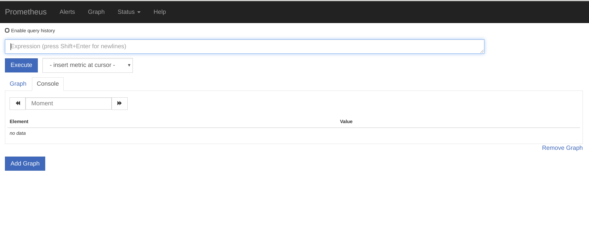

# Manually Install Prometheus and Grafana on Openshift

The Day2 tools provide Terraform that will install Prometheus and Grafana on your OpenShift system.  If you prefer to install these programs manually this file will guide you through the same steps as the Terraform.   

## Deploy the Prometheus Operator ##

### Logon and Create a New Project ###
First Logon to OpenShift then use the oc command to create a new project. In our examples we will use promograf as the project. Note that creating a project means creating a namespace with that name.

~~~
oc new-project promograf
~~~

### Allow Cross Namespace Monitoring

Copy the rbac.yaml file to your working directory and edit it to change both instances of the string **replace-me** with the name of your project.

Now apply the changes:
~~~
oc apply -f rbac.yaml
~~~
### Set up an Operator Group ###
Copy and edit the **operator-group.yaml**. Again replace both instances of the string **replace-me** with the name of your project. Then apply the changes:
~~~
oc apply -f operator-group.yaml
~~~
### Create the Prometheus Operator in your Project ###

Cpoy the **prometheus-operator.yaml** to your working directory and apply it.
~~~
oc apply -f prometheus-operator.yaml
~~~
You will receive a confirmation message when it completes.  You can confirm the install via:
~~~
oc get crd prometheuses.monitoring.coreos.com
~~~
## Install Prometheus ##
Copy the **prometheus.yaml** file to your working directory and apply it:
~~~
oc apply -f prometheus.yaml
~~~
Now expose the route to the service externally:
~~~
oc expose svc/prometheus-operated
~~~
Get the Prometheus UI address:
~~~
oc get route prometheus-operated -o=jsonpath='{@.spec.host}'
~~~

Paste the address into a browser and you will access the Prometheus UI.

## Install Grafana ##

### Deploy the Grafana Operator ###

Copy the **grafana-operator.yaml** to your working directory and apply it.

~~~
oc apply -f grafana-operator.yaml
~~~
You should receive a completion message at the terminal but you can also confirm by command:
~~~
oc get crd grafanas.integreatly.org
~~~
or by viewing the **Installed Operators** for your project from the OpenShift console:

### Create a Grafana Datasource ###
Copy the file **grafana-datasource.yaml** to your working directory and apply it.
~~~
oc apply -f grafana-datasource.yaml
~~~
### Create the Grafana instance ###
Copy the file **grafana.yaml** to your working directory and apply it.
~~~
oc apply -f grafana.yaml
~~~
Now confirm the Grafana service is running:

~~~
oc get svc grafana-service
~~~
Next expose the route for external access:
~~~
oc expose svc/grafana-service
~~~
And find the Grafana UI:
~~~
oc get route grafana-service -o=jsonpath='{@.spec.host}'
~~~
Plug that URL into a browser to see the Grafana UI:

## Deploy the OpenLiberty Dashboard ##
Copy the file ** grafana-dashboard-liberty.yaml ** to your working directory and apply it:
~~~
oc apply -f grafana-dashbord-liberty.yaml
~~~
If you now return to the Grafana UI and select the Liberty Dashboard you can see it is functional:

Once your Prometheus/Grafana Monitoring stack is watching deployed Liberty applications you can view the data in the dashboard.  This is the CPU view:

